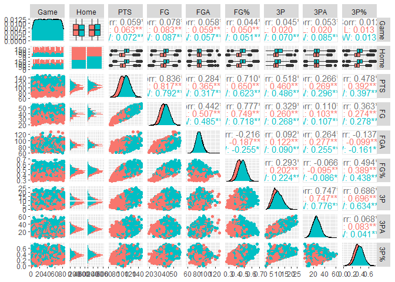
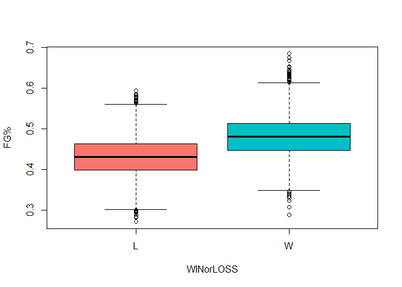
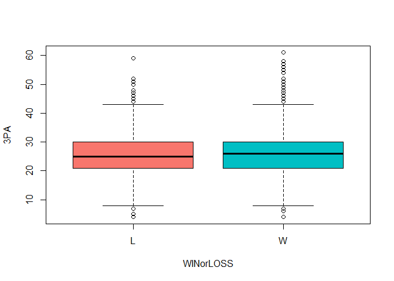
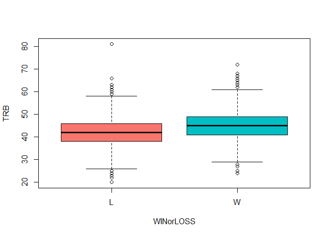

``` r
library(tidyverse)
```

    ## -- Attaching packages --------------------------------------- tidyverse 1.3.1 --

    ## v ggplot2 3.3.5     v purrr   0.3.4
    ## v tibble  3.1.6     v dplyr   1.0.8
    ## v tidyr   1.2.0     v stringr 1.4.0
    ## v readr   2.1.2     v forcats 0.5.1

    ## -- Conflicts ------------------------------------------ tidyverse_conflicts() --
    ## x dplyr::filter() masks stats::filter()
    ## x dplyr::lag()    masks stats::lag()

``` r
library(GGally)
```

    ## Registered S3 method overwritten by 'GGally':
    ##   method from   
    ##   +.gg   ggplot2

## load data

will clean and remove opposing team stats, since they’re included as the
primary on the mirror matchup (i.e. Atl-Tor, vs Tor-Atl) also removing
date, since Game is a better metric of when a game takes place in
relation to the point of the season

### Variable Descriptions

-   PTS - Team Points Scored
-   FG - Field Goals Made
-   FGA - Field Goals Attempted
-   FG% - Field Goal Percentage
-   3P - Three Points Made
-   3PA - Three Points Attempted
-   3P% - Three Point Percentage
-   FT - Free Throws Made
-   FTA - Free Throws Attempted
-   FT% - Free Throw Percentage
-   ORB - Offensive Rebounds
-   TRB - Total Rebounds
-   AST - Assists
-   STL - Steals
-   BLK - Blocks
-   TOV - Turnovers
-   PF - Fouls

``` r
rawdata <- read.csv("https://raw.githubusercontent.com/boneeyah/GroupProject2/main/DataFile/nba.games.stats.csv")
cleandata <- rawdata[,c(7,3,5,8,10:25)] #rearrange to leave W/L first

str(cleandata) #check variable type
```

    ## 'data.frame':    9840 obs. of  20 variables:
    ##  $ WINorLOSS            : chr  "L" "W" "L" "L" ...
    ##  $ Game                 : int  1 2 3 4 5 6 7 8 9 10 ...
    ##  $ Home                 : chr  "Away" "Home" "Away" "Away" ...
    ##  $ TeamPoints           : int  102 102 92 119 103 91 100 114 94 109 ...
    ##  $ FieldGoals           : int  40 35 38 43 33 27 39 42 40 41 ...
    ##  $ FieldGoalsAttempted  : int  80 69 92 93 81 71 76 75 90 85 ...
    ##  $ FieldGoals.          : num  0.5 0.507 0.413 0.462 0.407 0.38 0.513 0.56 0.444 0.482 ...
    ##  $ X3PointShots         : int  13 7 8 13 9 10 9 11 3 9 ...
    ##  $ X3PointShotsAttempted: int  22 20 25 33 22 27 20 28 22 27 ...
    ##  $ X3PointShots.        : num  0.591 0.35 0.32 0.394 0.409 0.37 0.45 0.393 0.136 0.333 ...
    ##  $ FreeThrows           : int  9 25 8 20 28 27 13 19 11 18 ...
    ##  $ FreeThrowsAttempted  : int  17 33 11 26 36 28 18 23 13 23 ...
    ##  $ FreeThrows.          : num  0.529 0.758 0.727 0.769 0.778 0.964 0.722 0.826 0.846 0.783 ...
    ##  $ OffRebounds          : int  10 3 10 7 12 9 13 3 11 13 ...
    ##  $ TotalRebounds        : int  42 37 37 38 41 38 46 36 37 38 ...
    ##  $ Assists              : int  26 26 26 28 18 20 23 33 26 22 ...
    ##  $ Steals               : int  6 10 14 8 10 7 8 10 6 7 ...
    ##  $ Blocks               : int  8 6 5 3 5 3 4 5 8 3 ...
    ##  $ Turnovers            : int  17 12 13 19 8 15 18 13 18 10 ...
    ##  $ TotalFouls           : int  24 20 25 33 17 16 12 20 12 17 ...

``` r
cleandata %>% count(WINorLOSS) %>% ggplot(aes(x=WINorLOSS, y= n, fill = WINorLOSS))+geom_bar(stat = "identity") 
```


``` r
#data is perfectly balanced, becasue for each win on the data set there is an opposing team who lost and vice-versa

#set categorical variables to factors
cleandata$WINorLOSS <- as.factor(cleandata$WINorLOSS)
cleandata$Home <- as.factor(cleandata$Home)

##change variable names
cleandata <- rename(cleandata, c("PTS" = TeamPoints, "FG"=FieldGoals,"FGA"=FieldGoalsAttempted, "FG%"=FieldGoals., "3PA"=X3PointShotsAttempted, "3P" = X3PointShots, "3P%"=X3PointShots.,"FT"=FreeThrows, "FTA"=FreeThrowsAttempted, "FT%"=FreeThrows.,"ORB"=OffRebounds,"TRB"=TotalRebounds, "AST"=Assists, "STL"=Steals,"BLK"=Blocks,"TOV"=Turnovers, "PF"=TotalFouls))

sapply(cleandata, function(x) sum(is.na(x))) #no NAs present
```

    ## WINorLOSS      Game      Home       PTS        FG       FGA       FG%        3P 
    ##         0         0         0         0         0         0         0         0 
    ##       3PA       3P%        FT       FTA       FT%       ORB       TRB       AST 
    ##         0         0         0         0         0         0         0         0 
    ##       STL       BLK       TOV        PF 
    ##         0         0         0         0

``` r
ggpairs(cleandata, columns = 2:10, aes(color = WINorLOSS))
```

    ## `stat_bin()` using `bins = 30`. Pick better value with `binwidth`.
    ## `stat_bin()` using `bins = 30`. Pick better value with `binwidth`.
    ## `stat_bin()` using `bins = 30`. Pick better value with `binwidth`.
    ## `stat_bin()` using `bins = 30`. Pick better value with `binwidth`.
    ## `stat_bin()` using `bins = 30`. Pick better value with `binwidth`.
    ## `stat_bin()` using `bins = 30`. Pick better value with `binwidth`.
    ## `stat_bin()` using `bins = 30`. Pick better value with `binwidth`.
    ## `stat_bin()` using `bins = 30`. Pick better value with `binwidth`.



``` r
ggpairs(cleandata, columns = 11:20, aes(color = WINorLOSS))
```

 There
is a separation between home and away also for team points, field goals,
field goal %, 3 point shots and 3 point shot % to a lesser extent, total
rebounds, assists, and turnovers

``` r
plot(WINorLOSS~Home, col = c("#F8766D","#00bfc4"), data = cleandata)
```


``` r
plot(PTS~Home, col = c("#F8766D","#00bfc4"), data = cleandata)
```


``` r
plot(`FG%`~Home, col = c("#F8766D","#00bfc4"), data = cleandata)
```



``` r
plot(FG~Home, col = c("#F8766D","#00bfc4"), data = cleandata)
```


``` r
plot(`3PA`~Home, col = c("#F8766D","#00bfc4"), data = cleandata)
```



``` r
plot(`3P%`~Home, col = c("#F8766D","#00bfc4"), data = cleandata)
```


``` r
plot(TRB~Home, col = c("#F8766D","#00bfc4"), data = cleandata)
```



``` r
plot(AST~Home, col = c("#F8766D","#00bfc4"), data = cleandata)
```


##correlation plot build a heatmap to check for correlation between
explanatory variables

``` r
library(lattice)
library(reshape2)
```

    ## 
    ## Attaching package: 'reshape2'

    ## The following object is masked from 'package:tidyr':
    ## 
    ##     smiths

``` r
library(ggthemes)
cleandata.corr <- round(cor(cleandata[,c(2,4:20)]),2)
cleandata.corr <- melt(cleandata.corr)

cleandata.corr %>% ggplot(aes(x=Var1, y=Var2, fill=value))+geom_tile()+scale_fill_viridis_c()+theme(axis.title.x = element_blank(),axis.title.y = element_blank())
```


``` r
#set seed
set.seed(8721)
##80-20 split of data
index <- sample(nrow(cleandata), round(.8*nrow(cleandata)))
train <- cleandata[index,]
test <- cleandata[-index,]


simple.mod <- glm(WINorLOSS~ Home + PTS + `FG%` + TRB, family = "binomial", data=train)
coef(simple.mod)
```

    ##  (Intercept)     HomeHome          PTS        `FG%`          TRB 
    ## -21.14561532   0.47434482   0.03098361  23.81551143   0.15718761

``` r
fit.pred <- predict(simple.mod, newdata = test, type = "response")
fit.pred <- ifelse(fit.pred > .5, "W", "L")
fit.pred <- factor(fit.pred, levels = c("W","L"))
test$WINorLOSS <- factor(test$WINorLOSS, levels = c("W", "L"))

caret::confusionMatrix(data =fit.pred, reference = test$WINorLOSS)
```

    ## Confusion Matrix and Statistics
    ## 
    ##           Reference
    ## Prediction   W   L
    ##          W 751 213
    ##          L 237 767
    ##                                           
    ##                Accuracy : 0.7713          
    ##                  95% CI : (0.7521, 0.7897)
    ##     No Information Rate : 0.502           
    ##     P-Value [Acc > NIR] : <2e-16          
    ##                                           
    ##                   Kappa : 0.5427          
    ##                                           
    ##  Mcnemar's Test P-Value : 0.2783          
    ##                                           
    ##             Sensitivity : 0.7601          
    ##             Specificity : 0.7827          
    ##          Pos Pred Value : 0.7790          
    ##          Neg Pred Value : 0.7639          
    ##              Prevalence : 0.5020          
    ##          Detection Rate : 0.3816          
    ##    Detection Prevalence : 0.4898          
    ##       Balanced Accuracy : 0.7714          
    ##                                           
    ##        'Positive' Class : W               
    ## 
